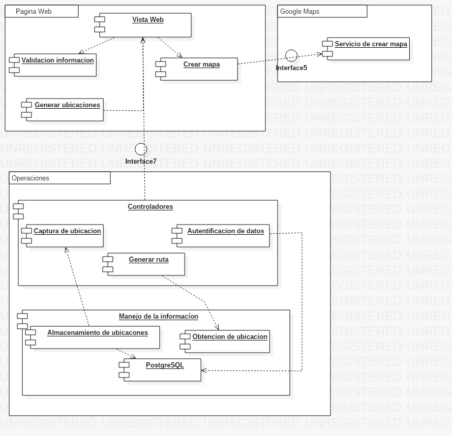

# Documento 3
---

## 1. Miembros del Equipo:

* José Orlando Rengifo Caicedo
* Ivan Vargas Santiago

## 2. Diseño de arquitectura de la Aplicación y Sistema
---

### a. Vista de desarrollo

### i. Definicion de Tecnologia de desarrollo

Se utilizo el popular framework web Ruby on Rails, un framework que sirve para crear aplicaciones web de una forma mas rapida, las tecnologias para las vistas usadas fueron HTML 5 junto con el framework Bootstrap.

### ii. URL's de Respositorio (Github)

https://github.com/santi2196/proyecto2-TET2018-2

### 3. Implementacion De Atributos de Calidad
---

## a. Implementación

